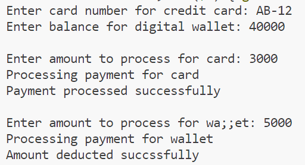

# 24K-0762-OOP-LAB9

# C++ Code Repository

## Preview
Here are the sample outputs of the programs:

### Task 1 Output:


### Task 2:


### Task 3:


### Task 4:


### Task 5:


---

## Code
Below are the C++ programs:

### Program 1: 
```cpp

#include<iostream>
using namespace std;
class Vehicle{
    protected:    
        string model;
        double rate;
    public:
        virtual double getDailyRate()=0;
        virtual void displayDetails()=0;
};
class Car: public Vehicle{
    public:
        Car(string m,double r){
            model=m;
            rate=r;
        }
        double getDailyRate(){
            return rate;
        }
        void displayDetails(){
            cout<<"Car Details\nModel: "<<model<<endl<<"Daily Rate: "<<rate<<endl;
        }
};
class Bike: public Vehicle{
    public:
        Bike(string m,double r){
            model=m;
            rate=r;
        }
        double getDailyRate(){
            return rate;
        }
        void displayDetails(){
            cout<<"Bike Details\nModel: "<<model<<endl<<"Daily Rate: "<<rate<<endl;
        }
};
int main(){
    Vehicle *vehicle;
    string model;
    double rate;
    cout<<"For Car"<<endl;
    cout<<"Enter model name: ";
    cin>>model;
    cout<<"Enter daily rate: ";
    cin>>rate;
    Car car(model,rate);
    cout<<endl<<"For Bike"<<endl;
    cout<<"Enter model name: ";
    cin>>model;
    cout<<"Enter daily rate: ";
    cin>>rate;
    Bike bike(model,rate);
    vehicle=&car;
    cout<<endl<<"Displayibg details rate by getDailyRate()"<<endl<<"For car: "<<vehicle->getDailyRate()<<endl;
    vehicle=&bike;
    cout<<"For nike: "<<vehicle->getDailyRate()<<endl<<endl;
    vehicle=&car;
    cout<<"Displaying car details"<<endl;
    vehicle->displayDetails();
    vehicle=&bike;
    cout<<endl<<"Displaying bike details"<<endl;
    vehicle->displayDetails();
    return 0;
}


## Code
Below are the C++ programs:

### Program 2: 
```cpp
#include<iostream>
using namespace std;
class SmartDevice{
    protected:
        bool status;
    public:
        virtual void turnOn()=0;
        virtual void turnOff()=0;
        virtual bool getStatus()=0;

};
class lightBulb: public SmartDevice{
    int brightness;
    bool isOn=status;
    public:
        lightBulb(int bright){
            if(bright>=0&&bright<=100){
                brightness=bright;
            }
            else{
                do{
                    cout<<"Invalid input. brightness ranges from (0-100%. Enter again: ";
                    cin>>brightness;
                }while(brightness<0||brightness>100);
            }
        }
        void turnOn(){
            status=1;
            isOn=1;
        }
        void turnOff(){
            status=0;
            isOn=0;
        }
        bool getStatus(){
            return status;
        }

};
class Thermostat: public SmartDevice{
    double temperature;
    bool isOn=status;
    public:
        void turnOn(){
            status=1;
            isOn=1;
        }
        void turnOff(){
            status=0;
            isOn=0;
        }
        bool getStatus(){
            return status;
        }

};
int main(){
    int bright;
    cout<<"Enter brightness for light bulb: ";
    cin>>bright;
    lightBulb bulb(bright);
    cout<<"Turning on bulb"<<endl;
    bulb.turnOn();
    cout<<"Checking status"<<endl;
    if(bulb.getStatus()){
        cout<<"Status: On"<<endl;
    }
    else{
        cout<<"Status: Off"<<endl;
    }
    cout<<"Turning off bulb"<<endl;  
    bulb.turnOff();
    cout<<"Checking status"<<endl;  
    if(bulb.getStatus()){
        cout<<"Status: On"<<endl;
    }
    else{
        cout<<"Status: Off"<<endl;
    }
    Thermostat thermo;
    cout<<endl<<"Turning on thermostat"<<endl;
    thermo.turnOn();
    cout<<"Checking status"<<endl;
    if(thermo.getStatus()){
        cout<<"Status: On"<<endl;
    }
    else{
        cout<<"Status: Off"<<endl;
    }
    cout<<"Turning off thermostat"<<endl;  
    thermo.turnOff();
    cout<<"Checking status"<<endl;  
    if(thermo.getStatus()){
        cout<<"Status: On"<<endl;
    }
    else{
        cout<<"Status: Off"<<endl;
    }
    return 0;
}


## Code
Below are the C++ programs:

### Program 3: 
```cpp
#include<iostream>
#include"book.h"
using namespace std;
int main(){
    string title,author,isbn;
    cout<<"Enter the ISBN of the book: ";
    cin>>isbn;
    cout<<"Enter the title of the book: ";
    cin>>title;
    cout<<"Enter the author of the book: ";
    cin>>author;
    Book book(title,author,isbn);
    cout<<endl<<"Displaying book details"<<endl;
    cout<<"ISBN: "<<book.getISBN()<<endl;
    cout<<"Title: "<<book.getTitle()<<endl;
    cout<<"Author: "<<book.getAuthor()<<endl;
    return 0;
}


book.cpp:
#include<iostream>
#include"book.h"
using namespace std;
Book::Book(string title,string author,string isbn):title(title),author(author),ISBN(isbn){}
string Book::getTitle(){
    return title;
}
string Book::getAuthor(){
    return author;
}
string Book::getISBN(){
    return ISBN;
}


Book.h:

#ifndef BOOK
#define BOOK
#include<string>
using namespace std;
class Book{
    string title,author,ISBN;
    public:
        Book(string title,string author,string isbn);
        string getTitle();
        string getAuthor();
        string getISBN();
};
#endif


## Code
Below are the C++ programs:

### Program 4: 
```cpp

#include<iostream>
using namespace std;
class PaymentMethod{
    public:
        virtual void processPayment(double amount)=0;
};
class CreditCard:public PaymentMethod{
    string cardNumber;
    public:
        CreditCard(string number):cardNumber(number){}
        void processPayment(double amount){
            if(amount>=0){
                cout<<"Payment processed successfully"<<endl;
            }
            else{
                cout<<"Invalid amount so payment cannot be processed"<<endl;
            }
        }
};
class DigitalWallet:public PaymentMethod{
    double balance;
    public:
        DigitalWallet(double balance):balance(balance){}
        void processPayment(double amount){
            balance-=amount;
            cout<<"Amount deducted succssfully"<<endl;
        }
};
int main(){
    string number;
    double balance,amount;
    cout<<"Enter card number for credit card: ";
    cin>>number;
    cout<<"Enter balance for digital wallet: ";
    cin>>balance;
    CreditCard card(number);
    DigitalWallet wallet(balance);
    cout<<endl<<"Enter amount to process for card: ";
    cin>>amount;
    cout<<"Processing payment for card"<<endl;
    card.processPayment(amount);
    cout<<endl<<"Enter amount to process for wa;;et: ";
    cin>>amount;
    cout<<"Processing payment for wallet"<<endl;
    wallet.processPayment(amount);
    return 0;
}


## Code
Below are the C++ programs:

### Program 5: 
```cpp
#include<iostream>
using namespace std;
class Activity{
    public:
        virtual double calculateCaloriesBurnt()=0;
};
class Running: public Activity{
    double distance,time;
    public:
        Running(double distance,double time):distance(distance),time(time){}
        double calculateCaloriesBurnt(){
            return distance*time;
        }
};
class Cycling: public Activity{
    double speed,time;
    public:
        Cycling(double speed,double time):speed(speed),time(time){}
        double calculateCaloriesBurnt(){
            return 30*speed*time;
        }
};
int main(){
    double v,s,t;
    cout<<"For Running Activity"<<endl;
    cout<<"Enter distance in km: ";
    cin>>s;
    cout<<"Enter time in minutes: ";
    cin>>t;
    Running run(s,t);
    cout<<endl<<"For Cycling Activity"<<endl;
    cout<<"Enter speed in km/h: ";
    cin>>v;
    cout<<"Enter time in hours: ";
    cin>>t;
    Cycling cycle(v,t);
    cout<<endl<<"Calories burnt for running acticity: "<<run.calculateCaloriesBurnt()<<endl;
    cout<<"Calcories burnt for cycling activity: "<<cycle.calculateCaloriesBurnt();
    return 0;
}


 


